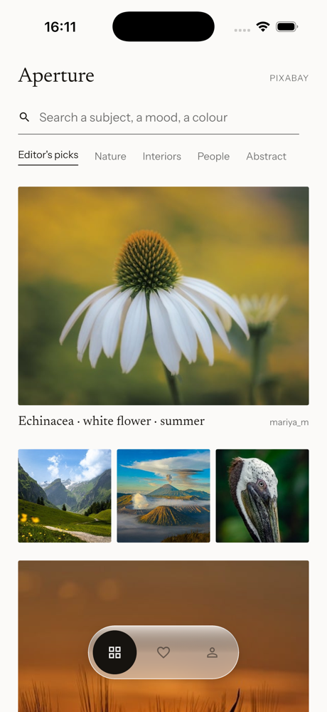
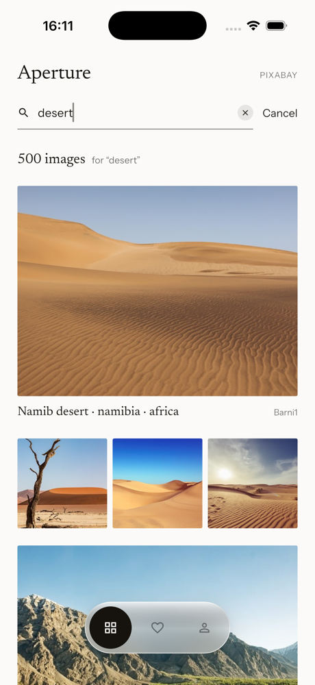
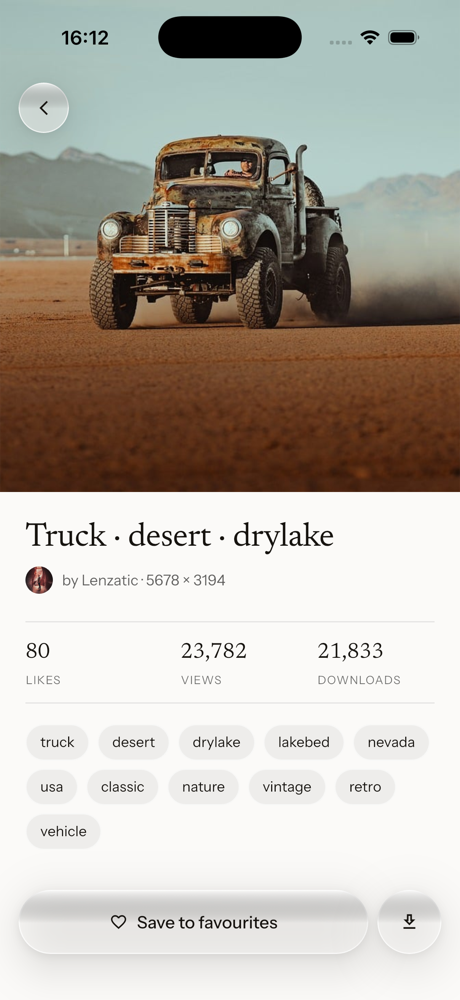
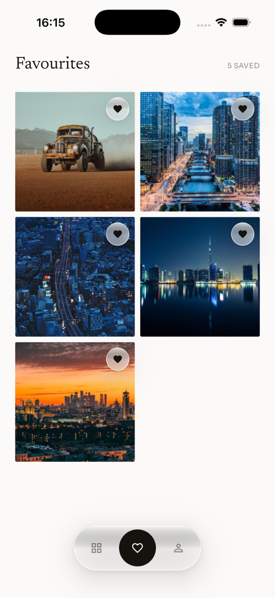

# Aperture

Aperture is a Flutter app for browsing, searching and saving photos from the
[Pixabay](https://pixabay.com/) REST API. It was built for the Flutter developer
assignment: GetX for state, dependency injection and routing; local storage for
Favourites; real Supabase email/password accounts.

## Features

- **Explore** — Pixabay editor's picks in a grid, with pull-to-refresh
- **Search** — debounced as you type (400 ms), results with the hit count, an
  empty state with suggestions
- **Pagination / infinite scrolling** — pages load as you near the bottom; a failed
  page keeps what is loaded and offers a retry
- **Image Details** — title, creator, size, views/downloads/likes, tags (tap a tag
  to search it), and a full-screen pinch-zoom viewer
- **Accounts** — Supabase email/password sign in and sign up; the session is
  restored on launch; log out from the Profile tab
- **Favourites** — signed-in users save and remove images from Details or the
  Favourites tab; duplicates are prevented; the list is stored locally per user
  and survives restarts
- **Offline Favourites** — the Favourites tab and Details for a saved image need no
  network (see *Offline behaviour*)
- **Image caching** — `cached_network_image` disk cache shared by every screen
- **Save to Photos** — the download button on Details writes the large image to the
  device Photos / media library
- **Error handling** — no connection, Pixabay API errors, a missing or invalid API
  key, empty search results, images that fail to load, and local-storage failures
  all have their own screen, tile or toast; nothing spins forever

Guests can browse, search and open Details; Favourites need an account.

## Architecture

Feature-first vertical slices. Each feature owns its models, data access, GetX
controller, binding and UI; `core/` holds only what more than one feature shares.

```
lib/
  core/
    config/      # Env: compile-time PIXABAY_API_KEY, SUPABASE_URL, SUPABASE_PUBLISHABLE_KEY
    routes/      # GetX route table (home, auth, image details, image viewer)
    theme/       # design tokens: colours, spacing, typography, ThemeData
    widgets/     # shared: glass surface and tab bar, pill buttons, state view, toast
  features/
    home/        # tab shell: IndexedStack keeps Explore, Favourites and Profile alive
    gallery/     # Explore feed, search, pagination, Image Details, download to Photos
    auth/        # Supabase accounts, sign-in / create-account screen, Profile tab
    favorites/   # per-user local Favourites
  main.dart
test/            # mirrors lib/; no test touches the network
```

Responsibility flow in every slice:

```
View  →  Controller  →  Repository  →  Service / data source
```

- **View** (`GetView`, `Obx`) renders a sealed state and forwards taps.
- **Controller** (`GetxController`) owns the state (`Rx<SealedState>`), debouncing,
  request-generation tokens for stale responses, and the optimistic Favourites queue.
- **Repository** is the domain boundary (e.g. Favourites identity by Pixabay id).
- **Service** is the only place a third-party API is touched: `PixabayService` (Dio),
  `SupabaseAuthService`, `FavoritesStorageService` (`shared_preferences`),
  `ImageDownloadService` (`flutter_cache_manager` + `gal`). Each maps failures to a
  typed exception; the UI shows its own copy, never a raw error.

GetX is used for state (`Rx` + sealed state classes, rebuilt through `Obx`),
dependency injection (`Bindings` per route; the app-scoped `AuthController` and
`FavoritesController` are put once at boot) and navigation (`GetMaterialApp`,
named routes, arguments type-checked in the route table).

## Tech

Flutter 3.47 / Dart 3.13 · [get](https://pub.dev/packages/get) ·
[dio](https://pub.dev/packages/dio) ·
[cached_network_image](https://pub.dev/packages/cached_network_image) +
[flutter_cache_manager](https://pub.dev/packages/flutter_cache_manager) ·
[supabase_flutter](https://pub.dev/packages/supabase_flutter) ·
[shared_preferences](https://pub.dev/packages/shared_preferences) ·
[gal](https://pub.dev/packages/gal) ·
[google_fonts](https://pub.dev/packages/google_fonts) (fonts bundled, no runtime
fetch) · tests with `flutter_test`, `mocktail`, `fake_async`, `file`.

## Setup

Requirements: Flutter 3.47+ (Dart 3.13+), Xcode for iOS, Android SDK 36 with JDK 17
for Android.

```sh
flutter pub get
```

### Environment variables

The app reads three values at build time via `--dart-define`; none is committed.

| Variable | Purpose |
|---|---|
| `PIXABAY_API_KEY` | Your key from [pixabay.com/api/docs](https://pixabay.com/api/docs/) (free account) |
| `SUPABASE_URL` | The Aperture Supabase project URL |
| `SUPABASE_PUBLISHABLE_KEY` | The project's **publishable** key (`sb_publishable_…`) |

Copy the example file and fill it in; `env.json` is gitignored:

```sh
cp env.example.json env.json
```

`env.example.json` contains placeholders only. See
[`supabase/README.md`](supabase/README.md) for the project and its Auth settings.
Only the publishable key ever goes in the app, never a service-role or secret key.

If `PIXABAY_API_KEY` is missing the app starts and shows an "API key missing" screen
with these instructions instead of sending a request. If the Supabase values are
missing, browsing still works and the Profile tab and sign-in screen explain the
missing configuration.

## Running

```sh
flutter run --dart-define-from-file=env.json
```

Or pass the values directly:

```sh
flutter run \
  --dart-define=PIXABAY_API_KEY=YOUR_KEY \
  --dart-define=SUPABASE_URL=https://YOUR_PROJECT.supabase.co \
  --dart-define=SUPABASE_PUBLISHABLE_KEY=sb_publishable_...
```

Pick a device with `-d` (`flutter devices`), for example `-d "iPhone 17 Pro"` or an
Android emulator id. Builds:

```sh
flutter build ios --simulator --no-codesign --dart-define-from-file=env.json
flutter build apk --debug --dart-define-from-file=env.json
flutter build apk --release --dart-define-from-file=env.json
```

## Testing

```sh
flutter test
flutter analyze
dart format --output=none --set-exit-if-changed .
```

The suite (300 tests) covers model parsing, the Pixabay service's error mapping,
controller behaviour under stale responses and races, the Favourites storage and
corruption handling, the Supabase error mapping, and widget tests for every screen
including narrow (320 pt) layouts and keyboard insets. Network, image and font
loading are all faked.

## Local Favourites

Favourites are stored on the device with `shared_preferences` as one JSON list per
account, under the key `favorites.<supabase user id>`. Accounts on the same device
never see each other's list, logging out leaves the data in place, and the same
image cannot be saved twice. If the stored value cannot be decoded the Favourites
tab shows an error with Retry and the app never overwrites it.

## Offline behaviour

- **Favourites** and **Details opened from Favourites** render from the stored
  data: title, creator, size, counts and tags need no network.
- **Saved images** show offline while they are still in the shared image cache
  (every image viewed in Details is cached). The cache is size- and age-limited, so
  a picture may need to reload; the Favourite entry itself is never removed.
- **Save to Photos** for a cached image works offline; otherwise it reports that a
  connection is needed.
- **Explore, Search and Details from the feed** need Pixabay and show the
  "No connection" screen with retry.
- **Sign in / sign up** need Supabase; an existing session is restored from local
  storage at launch.
- Typography is bundled, so the design fonts render on the first launch with no
  network.

## Save to Photos

The download button on Details fetches the large image through the image cache and
writes it to the Photos / media library with the `gal` plugin. A save in progress
ignores further taps. Outcomes are reported with a toast: saved, needs a
connection, Photos access denied (grant it in Settings), or couldn't save.

- **iOS** — `NSPhotoLibraryAddUsageDescription` and `NSPhotoLibraryUsageDescription`
  are declared in `Info.plist`; the first save prompts for add-only access.
- **Android** — `WRITE_EXTERNAL_STORAGE` is declared only for API 29 and below
  (`maxSdkVersion="29"`); Android 10+ needs no permission to write to the
  media library. Minimum SDK 24.

## Assignment bonus features

Pagination / infinite scrolling · pull-to-refresh · image caching · unit and widget
tests · debounced search · offline Favourite viewing. Dark mode is not implemented.

## Known limitations

- Favourites live on the device only: no sync between devices, no cloud backup.
- Offline availability of a saved *picture* depends on the shared image cache; the
  entry and its details are always available.
- The Android release build is signed with the debug keystore (no store signing
  configured).
- Password reset, social sign-in and account editing are out of scope.

## Screenshots and demo

See [`docs/screenshots/`](docs/screenshots/README.md) for the capture list and the
demo-recording flow.

| Explore | Search | Details | Favourites |
|---|---|---|---|
|  |  |  |  |
